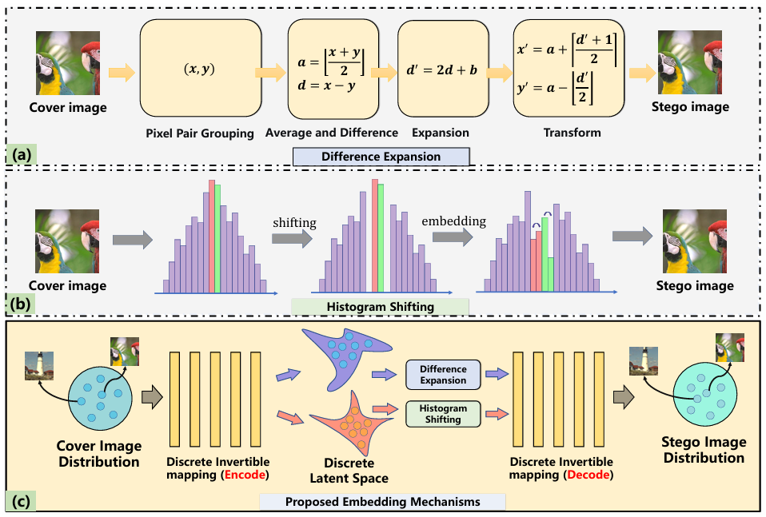
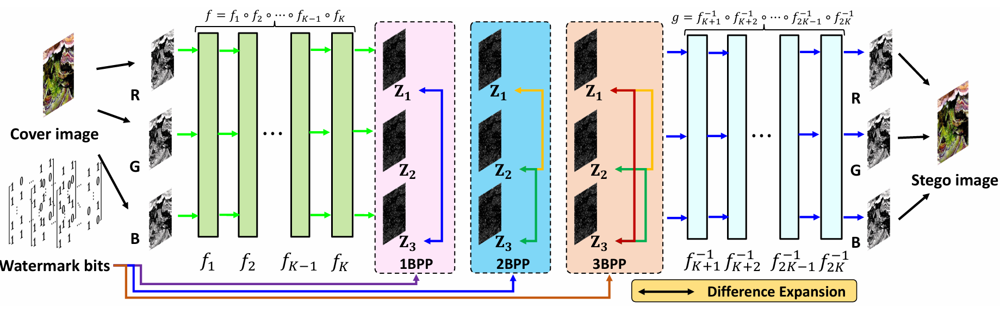
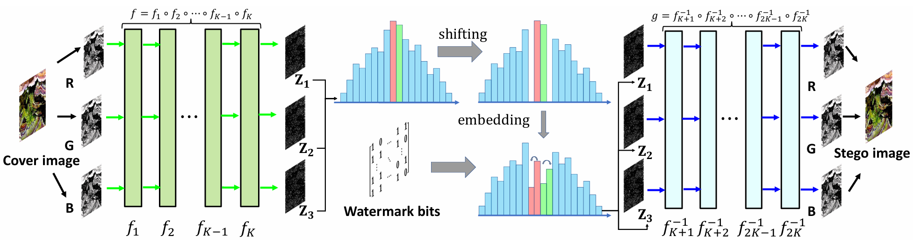

# 💧 High-Capacity Deep Reversible Watermarking via Discrete Latent Space Embedding

<p align="center">
  
  
  
  
</p>

<p align="center">
  <strong>✨ End‑to‑end trainable framework for high‑capacity reversible watermarking ✨</strong><br>
  <strong>🔁 Latent Difference Expansion (LDE) + Latent Histogram Shifting (LHS) 🔁</strong>
</p>

<br>

## 📌 Overview

This repository is the **official implementation** of the paper:

> **High-Capacity Deep Reversible Watermarking via Discrete Latent Space Embedding**  
> *Jiale Chen, Junnan Yin, Wei Wang, Chongyang Shi, Li Dong, Jiantao Zhou, Xiping Hu*

**DLSE** is the first deep learning based framework that achieves **high‑capacity reversible watermarking** with **end‑to‑end trainability**.  
We migrate the embedding operation from the pixel domain to the **discrete latent space** of images using integer discrete flows, and design two novel learnable mechanisms:

- 🧩 **Latent Difference Expansion (LDE)** – supports **1 to 3 bpp**
- 📊 **Latent Histogram Shifting (LHS)** – leverages sharp latent priors for higher capacity

The framework guarantees **lossless recovery** of both the cover image and the watermark.

<p align="center">
  
  <br>
  <em>Figure 1: Comparison of traditional pixel‑domain methods (DE/HS) vs. the proposed DLSE in discrete latent space.</em>
</p>

---

## 🚀 Key Features

| Feature | Description |
|:-------:|-------------|
| 🔁 **Strict Reversibility** | Exact recovery of original cover and watermark (lossless) |
| 🧠 **End‑to‑End Training** | Fully differentiable LDE/LHS modules + STE |
| 📦 **High Capacity** | 1–3 bpp (LDE) / adaptive capacity (LHS) |
| 🧩 **Two Embedding Modes** | Latent Difference Expansion (LDE) & Latent Histogram Shifting (LHS) |
| 🔧 **Dynamic Loss Adjustment** | Controls under/overflow with adaptive penalty |

---

## 🧱 Architecture Overview

### Latent Difference Expansion (LDE)

<p align="center">
  
  <br>
  <em>Figure 2: Overall framework of Latent Difference Expansion (LDE). The invertible network f maps the input image to a latent representation z. A difference expansion module then performs reversible embedding on the latent variables, yielding the modified representation ẑ. The invertible network g reconstructs the stego image as s = g(ẑ).</em>
</p>

### Latent Histogram Shifting (LHS)

<p align="center">
  
  <br>
  <em>Figure 3: Overall framework of Latent Histogram Shifting (LHS). The invertible network f maps the input image to a latent representation z. A histogram shifting module then performs reversible embedding on the latent variables, yielding the modified representation ẑ. The invertible network g reconstructs the stego image as s = g(ẑ).</em>
</p>


## 🛠️ Installation

```bash
## 🏋️ Training

### Latent Difference Expansion (LDE)

We provide training scripts for LDE with different embedding capacities (1, 2, 3 bpp) and prior configurations (NonePrior / Prior).

#### Training Commands

# LDE without Laplace prior (lambda_z = 0)
nohup python3 train_de.py --bpp 1 --lambda_stego 1 --lambda_penalty 1 --prior Laplace --penalty_loss_type MSE --lambda_z 0 --penalty_start_epoch 2000 --num_epoch 10000 --interval_epoch 25 --block_mode ResBlock --increase_penalty 1 --gpu_id 2 --batch_size 36 --train_name NonePrior --continue_train 1 > bpp_1.log 2>&1 &

nohup python3 train_de.py --bpp 2 --lambda_stego 1 --lambda_penalty 1 --prior Laplace --penalty_loss_type MSE --lambda_z 0 --penalty_start_epoch 2000 --num_epoch 10000 --interval_epoch 25 --block_mode ResBlock --increase_penalty 1 --gpu_id 3 --batch_size 36 --train_name NonePrior --continue_train 1 > bpp_2.log 2>&1 &

nohup python3 train_de.py --bpp 3 --lambda_stego 1 --lambda_penalty 1 --prior Laplace --penalty_loss_type MSE --lambda_z 0 --penalty_start_epoch 2000 --num_epoch 10000 --interval_epoch 25 --block_mode ResBlock --increase_penalty 1 --gpu_id 4 --batch_size 36 --train_name NonePrior --continue_train 1 > bpp_3.log 2>&1 &

# LDE with Laplace prior (lambda_z = 0.1)
nohup python3 train_de.py --bpp 1 --lambda_stego 1 --lambda_penalty 1 --prior Laplace --penalty_loss_type MSE --lambda_z 0.1 --penalty_start_epoch 3000 --num_epoch 10000 --interval_epoch 25 --block_mode ResBlock --increase_penalty 1 --gpu_id 5 --batch_size 36 --train_name Prior --continue_train 1 > bpp_1_prior.log 2>&1 &

nohup python3 train_de.py --bpp 2 --lambda_stego 1 --lambda_penalty 1 --prior Laplace --penalty_loss_type MSE --lambda_z 0.1 --penalty_start_epoch 3000 --num_epoch 10000 --interval_epoch 25 --block_mode ResBlock --increase_penalty 1 --gpu_id 6 --batch_size 36 --train_name Prior --continue_train 1 > bpp_2_prior.log 2>&1 &

nohup python3 train_de.py --bpp 3 --lambda_stego 1 --lambda_penalty 1 --prior Laplace --penalty_loss_type MSE --lambda_z 0.1 --penalty_start_epoch 3000 --num_epoch 10000 --interval_epoch 25 --block_mode ResBlock --increase_penalty 1 --gpu_id 7 --batch_size 36 --train_name Prior --continue_train 1 > bpp_3_prior.log 2>&1 &

### Latent Histogram Shifting (LHS)

# LHS without Laplace prior (lambda_z = 0)
nohup python train_hs.py --lambda_stego 1 --lambda_penalty 1 --lambda_z 0 --penalty_start_epoch 10000 --num_epoch 20000 --interval_epoch 5 --prior Laplace --block_mode ResBlock --increase_penalty 1 --gpu_id 0 --batch_size 36 > hs_laplace.log 2>&1 &

# LHS with Laplace prior (lambda_z = 0.1)
nohup python train_hs.py --lambda_stego 1 --lambda_penalty 1 --lambda_z 0.1 --penalty_start_epoch 10000 --num_epoch 20000 --interval_epoch 5 --prior Laplace --block_mode ResBlock --increase_penalty 1 --gpu_id 1 --batch_size 36 > hs_laplace.log 2>&1 &
